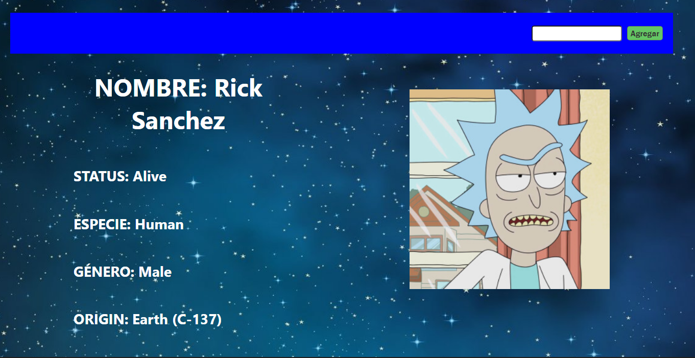
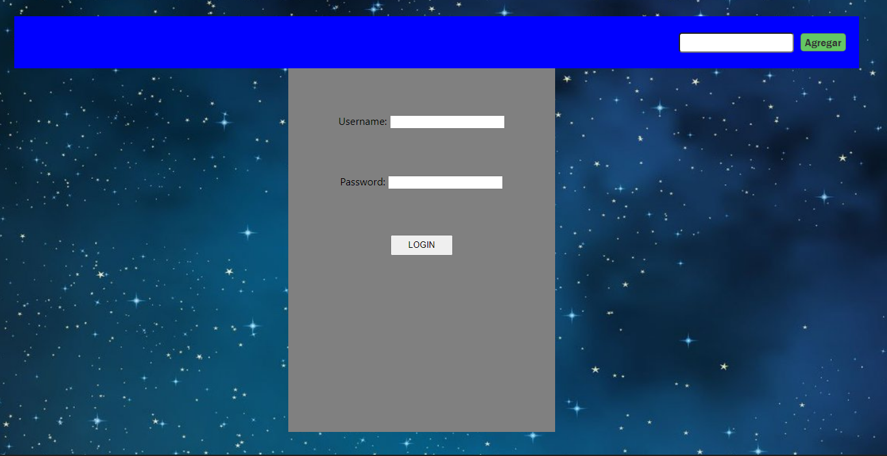
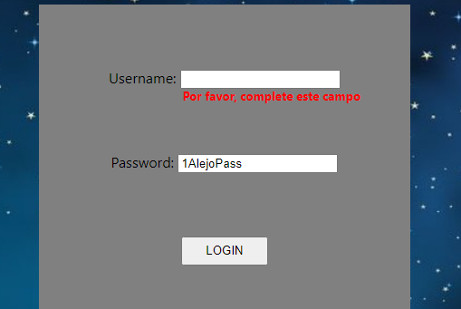

<!-- # Getting Started with Create React App

This project was bootstrapped with [Create React App](https://github.com/facebook/create-react-app).

## Available Scripts

In the project directory, you can run:

### `npm start`

Runs the app in the development mode.\
Open [http://localhost:3000](http://localhost:3000) to view it in your browser.

The page will reload when you make changes.\
You may also see any lint errors in the console.

### `npm test`

Launches the test runner in the interactive watch mode.\
See the section about [running tests](https://facebook.github.io/create-react-app/docs/running-tests) for more information.

### `npm run build`

Builds the app for production to the `build` folder.\
It correctly bundles React in production mode and optimizes the build for the best performance.

The build is minified and the filenames include the hashes.\
Your app is ready to be deployed!

See the section about [deployment](https://facebook.github.io/create-react-app/docs/deployment) for more information.

### `npm run eject`

**Note: this is a one-way operation. Once you `eject`, you can't go back!**

If you aren't satisfied with the build tool and configuration choices, you can `eject` at any time. This command will remove the single build dependency from your project.

Instead, it will copy all the configuration files and the transitive dependencies (webpack, Babel, ESLint, etc) right into your project so you have full control over them. All of the commands except `eject` will still work, but they will point to the copied scripts so you can tweak them. At this point you're on your own.

You don't have to ever use `eject`. The curated feature set is suitable for small and middle deployments, and you shouldn't feel obligated to use this feature. However we understand that this tool wouldn't be useful if you couldn't customize it when you are ready for it.

## Learn More

You can learn more in the [Create React App documentation](https://facebook.github.io/create-react-app/docs/getting-started).

To learn React, check out the [React documentation](https://reactjs.org/).

### Code Splitting

This section has moved here: [https://facebook.github.io/create-react-app/docs/code-splitting](https://facebook.github.io/create-react-app/docs/code-splitting)

### Analyzing the Bundle Size

This section has moved here: [https://facebook.github.io/create-react-app/docs/analyzing-the-bundle-size](https://facebook.github.io/create-react-app/docs/analyzing-the-bundle-size)

### Making a Progressive Web App

This section has moved here: [https://facebook.github.io/create-react-app/docs/making-a-progressive-web-app](https://facebook.github.io/create-react-app/docs/making-a-progressive-web-app)

### Advanced Configuration

This section has moved here: [https://facebook.github.io/create-react-app/docs/advanced-configuration](https://facebook.github.io/create-react-app/docs/advanced-configuration)

### Deployment

This section has moved here: [https://facebook.github.io/create-react-app/docs/deployment](https://facebook.github.io/create-react-app/docs/deployment)

### `npm run build` fails to minify

This section has moved here: [https://facebook.github.io/create-react-app/docs/troubleshooting#npm-run-build-fails-to-minify](https://facebook.github.io/create-react-app/docs/troubleshooting#npm-run-build-fails-to-minify)
 -->
<!-- # HW 08: React-Estado-LifeCycle | Integración

## **Duración estimada 🕒**

50 minutos

<br />

---

## **Rick & Morty App**

### **INTRO**

Hasta el momento, en nuestra Rick & Morty App tenemos estos 3 Componentes:

-  Card.jsx
-  Cards.jsx
-  SearchBar.jsx

Adicionalmente, vamos a crear otro componente denominado `Nav` que será nuestra barra superior de navegación, en la cual incluiremos el componente `SearchBar`.

También vamos a reestructurar nuestra vista **_"Home"_**, que no es más que nuestro archivo `App.js` para darle una forma más ordenada.

<br />

---

### **COMENCEMOS**

En el archivo `App.js` ya tenemos importados y estamos renderizando los 3 componentes que vamos a codear. Revisa el código, verás que le estamos pasando props a estos componentes.

<br />

---

### **👩‍💻 EJERCICIO 1**

### **Crear Nav**

1. Crear el componente `Nav`.
2. Escribir el código correspondiente en `components/Nav.jsx`.

> **Hint**: Este componente debe incluir el componente `SearchBar`.

<br />

---

### **👩‍💻 EJERCICIO 2**

### **Reestructurar Home**

1. Veamos primero una imagen del resultado final y pensemos la estructura general:


> -  **Recuadro rojo**: Nav
> -  **Recuadro amarillo**: SearchBar
> -  **Recuadro verde**: Cards
> -  **Recuadro azul**: Card

2. Ahora vamos a modificar el contenido del archivo `App.js`:

   -  En `App` sólo vamos a renderizar los componentes `Cards` y `Nav`.
   -  Ya no vamos a renderizar la primera `Card` "suelta" que pusimos en la primera clase. Ahora el componente `Cards` será quien contenga todas las `Card` individualmente.
   -  Lo mismo sucede con `SearchBar`. No lo vamos a seguir renderizando de forma directa en App, debido a que ya se encuentra dentro de `Nav`.

3. Importar y renderizar los componentes que vamos a utilizar.
4. Aplicar estilos básicos al componente **_Nav_**.

🔹 Resultado esperado:


<br />

---

### **👩‍💻 EJERCICIO 3**

### **Implementar un estado**

Necesitamos mantener actualizado el listado de personajes a mostrar. Para ello debemos crear un estado en el componente `App.js` donde tengamos el array de personajes.

1. Borra el import que traes de data.js (ya no vamos a usar más los datos de este archivo).
2. Importa el hook useState.
3. Crea un estado `characters` donde guardaremos el array de personajes.

<br />

---

### **👩‍💻 EJERCICIO 4**

### **Función para agregar personajes**

Ahora debemos crear una función llamada `onSearch` para agregar nuevos personajes a nuestro estado `characters` y se la pasaremos al `SearchBar` mediante el `Nav`.

> **Hint**: Como aún no hemos hecho el llamado a la API para obtener los datos del personaje, agregamos uno por default para ver que esté funcionando:

```jsx
const example = {
   name: 'Morty Smith',
   species: 'Human',
   gender: 'Male',
   image: 'https://rickandmortyapi.com/api/character/avatar/2.jpeg',
};
```

<br />

---

### **👩‍💻 EJERCICIO 5**

### **Le pasamos la función a Nav**

Nuestra función recién creada (que modifica el estado `characters`) se la pasamos al componente `Nav`.

<br />

---

### **👩‍💻 EJERCICIO 6**

### **Seguimos pasando la función para que llegue a su destino**

Quien finalmente debe ejecutar la función `onSearch` no es el `Nav` sino el `SearchBar`, por lo que debemos hacerle llegar dicha función.

<br />

---

### **👩‍💻 EJERCICIO 7**

### **Analizando función onSearch**

En la homework anterior **06-React-Intro, 02 - Integration**, ya habíamos creado el componente `SearchBar` que recibía la función como parámetro y la ejecutaba cuando se hacía un `submit` del form.

En este punto la función ya debería ejecutarse. Cada vez que le demos click al botón `Agregar` un nuevo personaje se añade a nuestro estado `characters`, y por cada uno de ellos nuestro componente `Cards` renderiza una `Card`.

Si observamos el código anterior estamos llamando a la función `onSearch` sin pasarle ningún parámetro, pero quisiéramos que ese parámetro dependa del input ingresado por el usuario.

<br />

---

### **👩‍💻 EJERCICIO 8**

### **Pasándole parámetros a la función**

1. Modifica el componente `SearchBar` para que mantenga un **estado** interno del nombre del personaje (`character`) escrito por el usuario y que cuando haya un cambio en el input, lo detecte mediante el listener `onChange` y actualice dicho estado.

2. Adicionalmente, pasar dicho estado `character` como parámetro de la función `onSearch` cuando la llamamos en el `submit`; para que utilice el estado, que contiene lo que ingresó el usuario y éste valor llegue así a la función **_onSearch_** que tenemos en **App.js**.

<br />

---

### **👩‍💻 EJERCICIO 9**

### **Buscando datos reales**

1. Comenta el código que engloba la constante **example**

2. Ahora debemos modificar la función `onSearch` para que obtenga los datos necesarios desde la API de [Rick&Morty](https://rickandmortyapi.com). Para ello vamos a utilizar `fetch` para hacer la llamada y obtener el resultado. Por el momento sólo vamos a obtener los personajes por ID, ya que si los buscamos por nombre hay demasiados resultados debido a que los mismos se repiten bastante.

3. Mostrar un mensaje en caso de que el personaje no exista.

> **Hint**: Como aún no has visto promesas, tienes este snippet para que copies y pegues la función **_onSearch_**:

```js
function onSearch(character) {
   fetch(`https://rickandmortyapi.com/api/character/${character}`)
      .then((response) => response.json())
      .then((data) => {
         if (data.name) {
            setCharacters((oldChars) => [...oldChars, data]);
         } else {
            window.alert('No hay personajes con ese ID');
         }
      });
}
```

> **Nota**: si tienes conocimiento base en promesas y deseas hacerlo de otra manera, puedes hacer la llamada utilizando `axios` para traer los datos. En caso que no, te invitamos a que veas el código y analices qué puede estar pasando.💡

<br />

---

### **👩‍💻 EJERCICIO 10**

### **Cerrar cards**

Por último, recordemos que en la homework anterior **06-React-Intro, 02 - Integration** habíamos creado el componente `Card` para que reciba una función como parámetro. Ésta va a ser la encargada de eliminar esa card al momento de hacer click en el botón `X`.

Para ello es necesario definir dicha función `onClose` en **App.js**, para que a partir del id recibido, elimina dicho personaje del array de personajes del **_estado_**.

> **Hint**: Puedes utilizar el método `filter`.

---

🔹 Resultado esperado:


Listo! tu app es ahora dinámica e interactiva!! 👏🏼🚀

<br />

---

## **📌 EJERCICIO EXTRA**

-  Controlar que no se puedan agregar personajes repetidos.
-  Generar un botón en la navbar que agregue un personaje random (Hint: hay 826 personajes en total).
 -->

<!--  # HW 09 - React-Routing | Integración

## **Duración estimada 🕒**

50 minutos

<br />

---

## **Rick & Morty App**

### **INTRO**

Continuamos con nuestra Rick & Morty App. Utilizaremos React-Router-DOM el cual nos va a permitir enrutar nuestra SPA. Esto quiere decir que podremos decidir en que path o "link" se renderice cada componente.

Al finalizar, habremos creado tres rutas por las que podremos navegar:

- **"/home"**: esta será la ruta del Home (vista principal/general).
- **"/detail/:detailId"**: en esta ruta encontraremos información más detallada sobre el personaje en particular.
- **"/about"**: en esta ruta colocarás tu nombre y describirás de qué trata la aplicación Rick & Morty.

<br />

---

## **COMENCEMOS**

Vamos a comenzar creando los componentes que nos faltan en nuestra carpeta components. Creamos `About.jsx` y `Detail.jsx` con sus respectivos archivos. Sólo los crearemos, aún no los construiremos. También creamos el archivo `.css` para el estilado. Recuerda que puedes utilizar cualquier formato de estilos (in-line, module, styled components, etc)

Cómo sabemos, `react-router-dom` nos da la posibilidad de crear rutas dinámicas. Estas rutas serán los path o links en el que se renderizará el componente que nosotros decidamos. Para este ejercicio queremos que en cada link se vea lo siguiente:

- `<Nav />` debe que aparecer en todas las rutas.
- `<Cards />` debe aparecer sólo en la ruta `/home`.
- `<About />` debe aparecer sólo en la ruta `/about`.
- `<Detail />` debe aparecer sólo en la ruta `/detail/:detailId`

<br />

---

### **👩‍💻 EJERCICIO 1**

### **Instalar y configurar `react-router-dom`**

Instala `react-router-dom` desde la terminal. Importa y envuelve la aplicación con "**BrowserRouter**" en el archivo index.js.

Importa los elementos "**Routes**" y "**Route**", para que luego definamos las rutas en el archivo app.js.

<br />

---

### **👩‍💻 EJERCICIO 2**

### **Mi perfil**

Ahora si construiremos el componente `<About />`. Este componente será una vista que contenga tu información y una explicación acerca de la aplicación!

Esto significa que es completamente libre. Puedes mostrar incluso una foto tuya. Esto le servirá a las personas que vean tu App para conocer al creador 🤠✨.

En la Navbar agrega el link About que dirija al componente **About** y el link Home para que dirija al componente **Home**.

<br />

---

### **👩‍💻 EJERCICIO 3**

### **Routing time!**

En nuestro archivo "app.js" (aplicación), crea las rutas necesarias para que los componentes `<About />`, `<Cards />` y `<Nav />` se rendericen en sus links correspondientes. Recuerda que en el **EJERCICIO 1** ya están especificadas las rutas.

Respecto al componente `<Detail />`, su ruta recibirá el parámetro **detailId**, por lo que debes asegurarte de escribir bien el path de esta ruta.

> **Nota:** Comprueba en tu navegador que los links rendericen el componente correcto, y que el componente `<Nav />` se vea siempre.

<br />

---

### **👩‍💻 EJERCICIO 4**

### **Detail redirection**

Ahora nuestra SPA cuenta con tres rutas distintas: "`/home`", "`/detail/:detailId`" y "`/about`".

Para este ejercicio:

1. En el componente `<Card />` importa y envuelve el nombre del personaje con el elemento "**Link**". Tiene que redirigirnos a la ruta de cada personaje.
2. A este componente deberás pasarle por **props** el "**id**" del personaje para usarlo en el Link.

```js
// Card.js
...
<Link to={`/detail/${props.id}`} >
  <h5 className="card-title">{props.name}</h5>
</Link>
...
```

<br />

---

### **👩‍💻 EJERCICIO 5**

### **Construcción del Detail**

¡Genial! Cuando hacemos click sobre el nombre en una Card esta nos redirige a la ruta con el ID del personaje. Ahora necesitamos crear el componente que mostrará toda la información del personaje.

Para obtener esta información importa los hooks **useState** de `react` y **useParams** de `react-router-dom` en el componente `<Detail />`.

1. Primero obten el ID del personaje mediante **useParams**.

2. Crea un estado local con el nombre **character**.

3. En este paso importaremos el hook **useEffect** de `react`. Una vez importado, copia el siguiente código y pégalo en el cuerpo del componente.

```js
useEffect(() => {
  fetch(`https://rickandmortyapi.com/api/character/${detailId}`)
    .then((response) => response.json())
    .then((char) => {
      if (char.name) {
        setCharacter(char);
      } else {
        window.alert("No hay personajes con ese ID");
      }
    })
    .catch((err) => {
      window.alert("No hay personajes con ese ID");
    });
  return setCharacter({});
}, [id]);
```

> **NOTA:** Este código es el que buscará al personaje de la API cada vez que el componente se monte. Y luego, cada vez que se desmonte, borrará su información.

<br />

---

### **👩‍💻 EJERCICIO 6**

Ahora en tu estado local **character** tendrás toda la información del personaje disponible para que la renderices en este componente (`<Detail />`). Debes traer la siguiente información:

- Name
- Status
- Specie
- Gender
- Origin
- Image

Dándole estilos debería quedarte algo similar a esto:



<br />

---

### **👩‍💻 EJERCICIO 7**

Crea un botón en el componente `<Detail />` que te permita regresar a "`/home`".

<br />

---

### **📌 EXTRA CREDIT**

Ahora te desafiamos a que crees un nuevo componente llamado **Error**. A este componente le podrás dar los estilos que quieras, pero la idea es que se muestre un mensaje de error 404.

Pueden inspirarte en el siguiente link: "https://github.com/errroorrxd".

El desafío es el siguiente: haz que este componente se muestre cada vez que el usuario ingrese a cualquier otra ruta que no exista. Es decir que no la hayas especificado en esta homework. Por ejemplo, si creaste una ruta "`/home`" y "`/about`", y el usuario en el navegador escribe y "`/henry`", debería mostrar el error 404.
 -->

 <!-- ## HW 10: React-Forms | Integración

## **Duración estimada 🕒**

60 minutos

<br />

---

## **Rick & Morty App**

### **INTRO**

En la integración de hoy crearemos un formulario de login. Así, cada vez que ingresemos a nuestra app tendremos que logearnos para utilizarla. Tanto el formulario como sus validaciones las haremos con Javascript.

Nuestro formulario va a estar compuesto de:

-  Username: el nombre de usuario tiene que ser un email, si no, tiene que mostrar un error.
-  Password: la contraseña tiene que contener por lo menos un número y tener una longitud de entre 6 y 10 caracteres, si no debe mostrar un error.

<br />

---

## **COMENCEMOS**

Vamos a comenzar creando el componente que nos falta en nuestra carpeta components. Creamos `Form.jsx` con su respectivo archivo `.css` para darle estilos.

---

### 👩‍💻 EJERCICIO 1

### Estructura

Vamos a trabajar en el archivo `Form.jsx` que acabas de crear.

Primero agregaremos una etiqueta `<div />` que envolverá a todo el componente. Tiene que haber una etiqueta `<label />` y una `<input />` tanto para el **username** como para la **password**. Por último, agrega una etiqueta `<button />`.

Dale algo de estilos al componente. Te dejamos una plantilla de cómo puede quedar!



<br />

---

### **👩‍💻 EJERCICIO 2**

### **Ruteo**

Ahora deberás cumplir los siguientes dos pasos:

1. Crea una ruta en el archivo `app.jsx` para que el formulario se renderice en el path "`/`".
2. Si obervas la imagen del ejercicio anterior, la barra de navegación también se muestra en el **Login**. Cambia esto de modo que el `<Nav />` se muestre en todos lados, menos en el **Login**.

> **PISTA:** investiga sobre el hook "useLocation" de react-router-dom, y piensa cómo hacer un renderizado condicional.

<br />

---

### **👩‍💻 EJERCICIO 3**

### **Estado del formulario**

El siguiente paso es poder controlar nuestro formulario. Para esto trabajaremos con un estado local con esta estructura:

```js
// Form.jsx
const [userData, setUserData] = React.useState({ username: '', password: '' });
```

Ahora conecta tu estado local con los inputs correspondientes utilizando la propiedad `value`.

Por último, usaremos el evento `onChange` en ambos inputs para poder guardar la información del usuario. Te sugerimos que crees una función **handleInputChange** la cual reciba el evento del input, y a partir de esta se modifique el estado local.

<br />

---

### **👩‍💻 EJERCICIO 4**

### **Validaciones**

En tu componente `<Form />` crea un nuevo estado local llamado "**errors**". Este es el estado que usarás para encontrar errores en el formulario.

Luego crea un nuevo archivo en la carpeta de tu componente Form.jsx con el nombre "**validation.js**". Aquí dentro deberás crear una función que valide lo siguiente:

**USERNAME**

-  el nombre de usuario tiene que ser un email _(explora validaciónes REGEX en internet!)_.
-  el nombre de usuario no puede estar vacío.
-  el nombre de usuario no puede tener más de 35 caracteres.

**PASSWORD**

-  la contraseña tiene que tener al menos un número.
-  la contraseña tiene que tener una longitud entre 6 y 10 caracteres.

No te olvides de renderizar y darle estilos a tus errores! Te dejamos un ejemplo de cómo puede quedar.



<br />

---

### **👩‍💻 EJERCICIO 5**

### **Simulación de seguridad**

Ahora simularemos una base de datos donde esté guardado un username y password. De esta forma, solo si la información de usuario coincide podrá usar la aplicación. Para esto:

1. En el archivo `App.js` crea lo siguiente:

   -  Un estado local llamado "**access**" que se inicialice en `false`.
   -  Una variable llamada "**username**", y que sea igual a tu email.
   -  Una variable "**password**", y que sea igual a una contraseña.

2. Crea una función llamada "**login**" que reciba por parámetro "_userData_". Esta función tiene que preguntar si el username y password que declaraste más arriba son iguales a los que les está llegando por parámetro. En caso afirmativo, el estado local access ahora será `true`. Importa el hook "**useNavigate**" de `react-router-dom` y haremos que nos redirija a `/home` si la información es correcta.

```jsx
const navigate = useNavigate();
const [access, setAccess] = useState(false);
const username = 'ejemplo@gmail.com';
const password = '1password';

function login(userData) {
   if (userData.password === password && userData.username === username) {
      setAccess(true);
      navigate('/home');
   }
}
```

3. Por último, lleva el siguiente código a tu componente (no te olvides de importar el `useEffect`).

```javascript
//App.js
useEffect(() => {
   !access && navigate('/');
}, [access]);
```

Esto no nos dejará navegar por la aplicación, al menos que ingresemos la información correcta!

<br />

---

### **👩‍💻 EJERCICIO 6**

### **Login**

Ahora le daremos la funcionalidad de cambiar los permisos a nuestro login! Para esto:

1. En el archivo `App.js`, le pasaremos la función **login** que creaste en el ejercicio anterior por props al componente `<Form />`.

2. En el componente `<Form />`, crea una función "**handleSubmit**". Esta función por dentro sólo debe ejecutar la función "**login**" recibida por props. No te olvides de pasarle por parámetro tu estado local _userData_!

¡Listo! Ya tienes un Login funcional!!😀🥳🤓

Pruebalo ingresando la información que declaraste previamente.

<br />

---

### **📌 EJERCICIO EXTRA**

-  Ahora te desafiamos a que crees un botón "**Logout**" en tu componente `<Nav />`. Si lo presionas debe quitar los permisos de acceso y redirigirte automáticamente a tu componente `<Form />`.

> **PISTA:** lo puedes hacer creando una función **logout** en tu archivo App.js.
 -->

<!-- ## HW 12: React-Redux | Integración

## **Duración estimada 🕒**

x minutos

<br />

---

## **Rick & Morty App**

## **INTRO**

En la integración de hoy crearemos un espacio en el que podremos guardar a nuestros personajes favoritos. ¡Podremos agregarlos y eliminarlos!

Para esto:

-  ❤️ Fav button: nuestras Cards tendrán un botón para agregar/eliminar de favoritos.
-  👀 Vista nueva: crearemos una nueva vista en la que se muestre específicamente todos nuestros personajes favoritos.

<br />

---

### **COMENCEMOS**

Para comenzar, en tu terminal dirígete a la carpeta raíz de tu proyecto. Allí tendrás que instalar las siguientes dependencias:

```bash
npm i redux react-redux redux-thunk
```

Una vez instaladas, a la altura de la carpeta "_components_" (es decir, que sea una carpeta hermana), crea una nueva carpeta llamada "**redux**". Dentro de ella crea los archivos `actions.js`, `store.js` y `reducer.js`.

Dentro del archivo `store.js`, haz la configuración del store. Una vez configurado, deberás importarlo en tu archivo `index.js` junto con el Provider, y configurarlo en el wraper finalmente.

> **NOTA:** puedes guiarte por cómo lo tienes hecho en la homework anterior. Ten en cuenta que el reducer lo crearás en el siguiente paso.

<br />

---

## **👩‍💻 EJERCICIO 1**

### **REDUCER**

Dirígete al archivo en el que se encuentra tu **reducer**. Allí deberás:

1. Crear un _**initialState**_ con una propiedad llamada "**myFavorites**". Esta propiedad será un array vacío.

2. Luego deberás crear tu reducer. Recuerda que este recibe dos parámetros, y dentro de él hay un switch.

> **NOTA:** ten en cuenta el modo en el que lo exportas, y cómo lo importas dentro de tu store.

3. Dentro del switch de tu reducer, crea un nuevo caso en el que podrás agregar el personaje que recibes por payload a tu estado "_myFavorites_".

4. Crea un nuevo caso en el elimines el personaje que recibes por payload de tu estado inicial. Deberás filtrar el personaje a partir de su **ID**.

5. No te olvides de tu caso _**default**_.

<br />

---

## **👩‍💻 EJERCICIO 2**

### **ACTIONS**

Crea dos _actions-creators_.

-  Una que sea para agregar personajes a tu lista de favoritos. Recibe por parámetro el personaje.

-  Otro que sea para eliminar un personaje de la lista de favoritos. Recibe por parámetro el id del personaje.

> **NOTA:** no olvides que el nombre que asignes en la propiedad "TYPE" de tu acción, debe coincidir exactamente con el nombre de los casos que hayas asignado en tu reducer.

<br />

---

## **👩‍💻 EJERCICIO 3**

### **FAV BUTTON**

Ahora crearemos un botón para agregar y eliminar de favoritos! Para esto:

1. Dirígete al componente `Card`. Aquí deberás crear una función **mapDispatchToProps** que contenga dos funciones: Una para agregar tu personaje favorito, y otra para eliminarlo. Ten en cuenta que deberás importar las _**actions**_ que ya creaste.

2. Luego conecta esta función con tu componente, y recibe ambas funciones despachadoras por props.

3. Ahora crea un estado local en tu componente que se llame **isFav**, e inicialízalo en `false`.

4. Crea una función en el cuerpo del componente llamada **handleFavorite**. Esta función estará dividida en dos partes:

   -  Si el estado _**isFav**_ es `true`, entonces settea ese estado en false, y despacha la función **deleteFavorite** que recibiste por props pasándole el **ID** del personaje como argumento.
   -  Si el estado _**isFav**_ es `false`, entonces settea ese estado en true, y despacha la función **addFavorite** que recibiste por props, pasándole `props` como argumento.

5. Ahora te ayudaremos a crear un renderizado condicional. Si tu estado local `isFav` es true, entonces se mostrará un botón. Si es false, se mostrará otro botón. Para esto, copia y pega el siguiente código al comienzo del renderizado de tu componente (no te olvides de darle estilos).

```javascript
{
   isFav ? (
      <button onClick={handleFavorite}>❤️</button>
   ) : (
      <button onClick={handleFavorite}>🤍</button>
   );
}
```

En este punto debería quedarte algo como esto:


6. Una vez hecho esto, nos tenemos que asegurar que el status de nuestro estado local se mantenga aunque nos vayamos y volvamos al componente. Para esto vamos a agregar en este componete una función **mapStateToProps**. Esa función debe traer nuestro estado global **myFavorites**. Recíbelo por `props` dentro de tu componente.

7. Este `useEffect` comprobará si el personaje que contiene esta `Card` ya está dentro de tus favoritos. En ese caso setteará el estado **isFav** en true. Cópialo y pégalo dentro de tu componente (no te olvides de importarlo).

```javascript
useEffect(() => {
   myFavorites.forEach((fav) => {
      if (fav.id === props.id) {
         setIsFav(true);
      }
   });
}, [myFavorites]);
```

> **DESAFÍO:** te desafiamos a que reconstruyas ese useEffect, pero utilizando un **bucle For** en lugar de un **.forEach()**.

<br />

---

## **👩‍💻 EJERCICIO 4**

### **COMPONENTE DE FAVORITOS**

Dirígete a tu carpeta de componentes, y crea allí dentro una carpeta que contenga un archivo `Favorites.jsx` y otro `favorites.css`.

1. Crea una ruta en el archivo `App.js` para mostrar este componente. La ruta se puede llamar **/favorites**. También crea un botón en tu `Navbar` que te redirija a esta ruta, y otro que te devuelva a tu `Home`.

2. Dentro de este componente crea una función **mapStateToProps**. Esta función debe traer nuestro estado global _**myFavorites**_ a este componente. Luego recíbelo por props.

3. Una vez que tengas la lista de tus personajes favoritos dentro de tu componente, deberás mappearlo (recorrerlo) y re-renderizar un `<div>` con información del personaje.

> **NOTA:** no te olvides de darle estilos al componente.

<br />

---

### **¡LISTO! YA FUNCIONA TODO**

Todo el trabajo que hiciste en esta integración debería darte un resultado y funcionamiento similar a este:


<br />

---

## **📌 EJERCICIO EXTRA**

### **¡Ahora te proponemos dos desafíos!**

**1.** Si revisas, esta aplicación tiene un pequeño bug que tendrás que resolver... Cuando presionas el ❤️ de una de las Cards, el personaje aparece en la vista de "**Favoritos**". Pero si luego eliminas el personaje, este aún permanece en esta vista. Busca la manera para que cuando elimines un personaje, también se elimine de "**Favoritos**" (si es que está allí).

**2.** Te animamos a que crees, dentro de esta misma aplicación, una nueva vista que sea tu "**PORTFOLIO**". Aquí podrás agregar/eliminar/editar tus proyectos construidos durante el bootcamp en Henry!
 -->

## HW 13: React-Hooks | Integración

## **Duración estimada 🕒**

x minutos

<br />

---

## **Rick & Morty App**

## **INTRO**

En esta homework crearemos dos cosas😄

-  Por un lado, haremos un **filtrado** para nuestros personajes favoritos. Vamos a filtrar todos los personajes por su género. En total hay cuatro géneros:

```javascript
['Male', 'Female', 'unknown', 'Genderless'];
```

-  Por otro lado, haremos un **ordenamiento** también para nuestros personajes favoritos. Vamos a ordenar todos los personajes por su id (de mayor a menor y viceversa).

<br />

---

## **👩‍💻 EJERCICIO 1**

### **ACTIONS**

Dirígete al archivo en el que se encuentran tus **actions**. Allí deberás:

1. Crear una action-creator con el nombre "**_filterCards_**". Esta action-creator recibirá por parámetro un **status**. La action que retornará tendrá un _type_ llamado "**FILTER**", y dentro del _payload_ irá el género recibido.

2. Crear una action-creator con el nombre "**_orderCards_**". Esta action-creator recibirá por parámetro un **id**. La action que retornará tendrá un _type_ llamado "**ORDER**", y dentro del _payload_ irá el id recibido.

<br />

---

## **👩‍💻 EJERCICIO 2**

### **REDUCER**

Para comenzar a trabajar, primero tendremos que crear un estado global en el que se guarden todos nuestros personajes a medida que los vamos agregando. Dirígete al archivo en el que se encuentra tu reducer:

1. Crea un nuevo estado global (dentro del _initialState_) llamado _**allCharacters**_. Este debe ser un arreglo vacío.

2. Dentro del caso **ADD_FAV** estás haciendo una copia de tu estado _**myFavorites**_. Tendrás que reemplazar esto por una copia de tu nuevo estado _**allCharacters**_. Una vez hecho esto, en el estado que retorna este caso deberás agregar también la propiedad _**allCharacters**_ e igualarla a la copia de tu estado.

3. Crea un caso con el nombre "_FILTER_". Haz una copia de tu estado "**_allCharacters_**" mediante destructuring. Filtra aquellos personajes que tengan el mismo género que recibes por payload. Retorna tu estado global, pero que la propiedad **_myFavorites_** sea igual al filtrado que haz hecho.

4. Crea un caso con el nombre "_ORDER_". Haz una copia de tu estado "**_allCharacters_**" mediante destructuring. Utiliza el método **sort** de arreglos para ordenar tus personajes en base al número de su ID. Si el _payload_ es "**Ascendiente**", entonces de menor a mayor. Si el _payload_ es "**Descendiente**, entonces de mayor a menor. Retorna tu estado global, pero que la propiedad **_myFavorites_** sea igual al ordenamiento que haz hecho.

> **NOTA:** investiga en la web sobre cómo funciona el método sort.

<br />

---

## **👩‍💻 EJERCICIO 3**

### **FILTER/ORDER COMPONENT**

Dirígete al archivo en el que se encuentra tu componente **Favorites**. Allí deberás:

1. Dentro de un `div`, crea dos elementos de HTML **selector**.

   -  Dentro del primero le pasaremos dos opciones: **Ascendente** y **Descendente**. Asegúrate de pasarles estos valores en sus atributos `value`. Por ejemplo:

   ```html
   <option value="Ascendente">Ascendente</option>
   ```

   -  Dentro del segundo pásales las opciones: **Male**, **Female**, **Genderless** y **unknown**. Asegúrate de pasarles estos valores en sus atributos `value`. Por ejemplo:

2. Cada vez que se seleccione una opción de ordenamiento, despacha la action "**orderCards**". Recuerda pasarle por parámetro el `e.target.value` del input. Utiliza el hook `useDispatch`.

3. Cada vez que se seleccione una opción de filtrado, despacha la action "**filterCards**". Recuerda pasarle por parámetro el `e.target.value` del input. Utiliza el hook `useDispatch`.

<br />

---

A esta altura, tu filtro y ordenamiento debería estar funcionando de la siguiente manera!


